<p align="center">
  
</p>

<h3 align="center">Nền tảng AI biên cho tự động hóa IoT</h3>

<p align="center">
  Trí tuệ biên vận hành bằng Rust — kết nối thiết bị, chạy AI agent, tự động hóa mọi thứ.
</p>

<p align="center">
  
  <a href="https://github.com/CVEDIX/HeraMind/releases/latest">
    
  </a>
  <a href="https://github.com/CVEDIX/HeraMind/stargazers">
    
  </a>
  <a href="https://discord.gg/cvedixai">
    
  </a>
  
  
  
</p>

<br/>

<div align="center">
  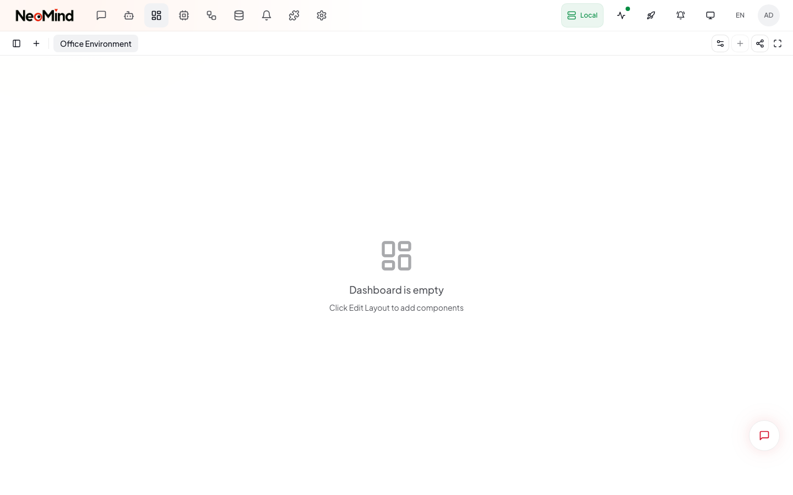
  <br/><sub><b>Bảng điều khiển</b></sub>
</div>

<br/>

<div align="center">
  <table>
    <tr>
      <td align="center">
        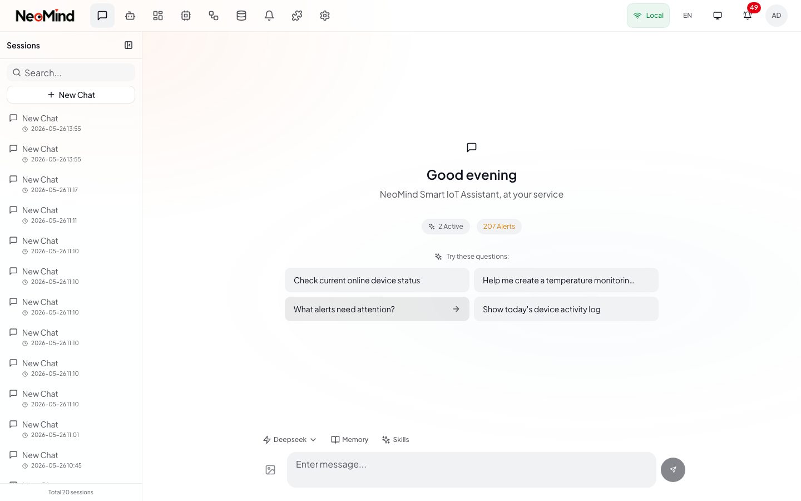
        <br/><sub><b>AI Chat</b></sub>
      </td>
      <td align="center">
        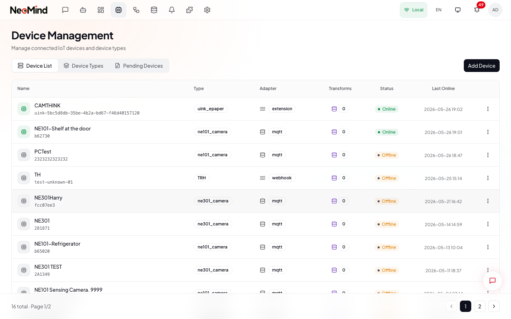
        <br/><sub><b>Quản lý thiết bị</b></sub>
      </td>
      <td align="center">
        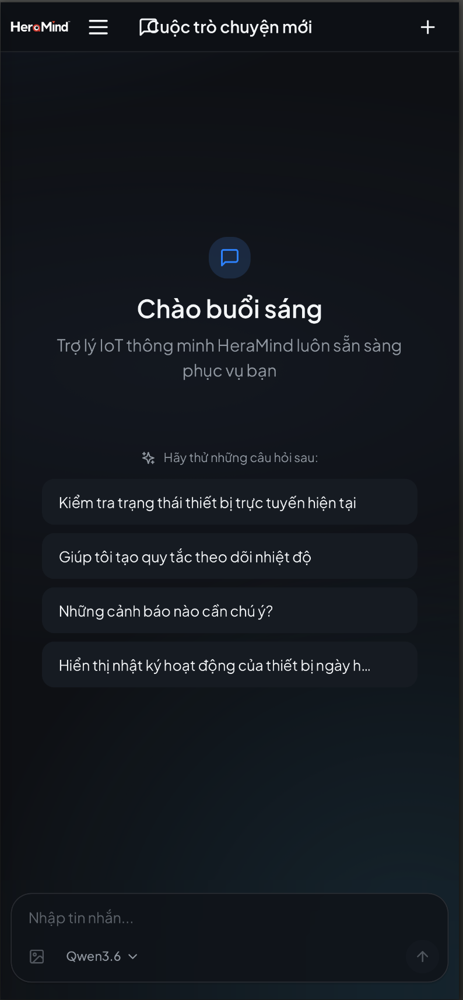
        <br/><sub><b>Web di động</b></sub>
      </td>
    </tr>
  </table>
</div>

<br/>

## HeraMind là gì?

HeraMind là một **nền tảng AI triển khai ở biên** đưa trí tuệ vào IoT. Nền tảng chạy các agent dùng LLM trực tiếp trên phần cứng của bạn, kết nối với thiết bị qua MQTT/BLE/Webhook, tự động hóa phản hồi bằng rule engine, và trực quan hóa mọi thứ trên các bảng điều khiển thời gian thực — không cần phụ thuộc vào dịch vụ đám mây.

**Ý tưởng cốt lõi**: Trò chuyện với thiết bị bằng ngôn ngữ tự nhiên. AI hiểu ý định của bạn, truy vấn trạng thái thiết bị, tạo quy tắc tự động hóa, và tự chủ thực hiện hành động.

> **Tài liệu đầy đủ có trên [tài liệu HeraMind](https://docs.cvedix.com/heramind).** README này là phần tổng quan nhanh — hãy xem tài liệu để đọc hướng dẫn đầy đủ:
>
> - [HeraMind là gì?](https://docs.cvedix.com/heramind) — tổng quan sản phẩm và khái niệm
> - [Khởi động nhanh trong năm phút](https://docs.cvedix.com/heramind) — chạy hệ thống thật nhanh
> - [Cài đặt & thiết lập](https://docs.cvedix.com/heramind) — triển khai, ứng dụng desktop, server, Docker
> - [Hướng dẫn lập trình viên](https://docs.cvedix.com/heramind) — API, extension, tích hợp

### Vì sao chọn HeraMind?

- **Tự chứa hoàn toàn** — MQTT broker nhúng, lưu trữ redb, không cần cài database hay broker bên ngoài
- **Type-safe từ đầu đến cuối** — Backend Rust với bảo đảm lúc biên dịch; lệnh CLI của agent được dispatch in-process bằng dữ liệu có cấu trúc, không phụ thuộc vào parse chuỗi mong manh
- **Extension chống sập hệ thống** — Extension chạy trong các tiến trình cô lập với quyền dựa trên capability; một extension lỗi không làm sập server
- **Có thể không dùng cloud** — Hoạt động 100% offline với LLM cục bộ (Ollama), hoặc kết nối mô hình cloud khi cần nhiều năng lực hơn

## Tính năng

### Trí tuệ vận hành bằng AI
- **Chat ngôn ngữ tự nhiên** — Giao diện hội thoại để truy vấn và điều khiển mọi thiết bị đã kết nối
- **Agent tự chủ** — AI agent chạy theo lịch để giám sát, phân tích và hành động độc lập trên dữ liệu thiết bị
- **Hơn 10 backend LLM** — Ollama, OpenAI, Anthropic, Google, xAI, Qwen, DeepSeek, GLM, MiniMax, và mọi endpoint tương thích OpenAI
- **Hệ thống bộ nhớ** — Bộ nhớ nhiều tầng (Người dùng, Tri thức, Quy trình, Phiên) với cơ chế tự động trích xuất và nén
- **Hệ thống skill** — Skill bằng YAML+Markdown để định hướng hành vi agent cho từng kịch bản cụ thể
- **Đa phương thức** — Hỗ trợ tải ảnh lên và phân tích hình ảnh

### Quản lý thiết bị
- **Giao thức MQTT** — Cách tích hợp thiết bị chính với broker nhúng, mTLS, và hỗ trợ chứng chỉ CA
- **BLE Provisioning** — Thiết lập thiết bị không chạm qua Bluetooth (Tauri native + Web Bluetooth)
- **HTTP/Webhook** — Adapter thiết bị linh hoạt cho thiết bị dựa trên REST
- **Tự động phát hiện** — Tự động nhận diện thiết bị, đăng ký loại thiết bị, và onboarding có AI hỗ trợ
- **Hàng đợi lệnh** — Gửi lệnh điều khiển tới thiết bị với xác thực tham số và theo dõi thực thi
- **Loại thiết bị tùy chỉnh** — Định nghĩa metric và lệnh thiết bị qua JSON type definition

### Tự động hóa
- **Rule engine** — Quy tắc dựa trên JSON với điều kiện đệ quy (so sánh/khoảng/logic) và action (notify/execute/trigger_agent), có cooldown và chống nhiễu bằng `for_duration`
- **Biến đổi dữ liệu** — Biến đổi dữ liệu bằng JavaScript để tạo metric ảo
- **Agent theo lịch** — Thực thi AI agent theo thời gian và theo sự kiện
- **Event bus** — Kiến trúc pub/sub giúp các thành phần giao tiếp tách rời

### Bảng điều khiển & trực quan hóa
- **Trình dựng kéo-thả** — Trình chỉnh sửa bảng điều khiển trực quan với layout lưới responsive
- **Widget phong phú** — Thẻ giá trị, biểu đồ, đồng hồ đo, bảng, thành phần thị giác VLM
- **Cập nhật thời gian thực** — WebSocket/SSE để stream dữ liệu trực tiếp lên dashboard
- **Chia sẻ dashboard** — Link công khai có thời hạn để chia sẻ dashboard
- **Component tùy chỉnh** — Tự xây dựng và phát hành widget dashboard của bạn

### Thông báo & đẩy dữ liệu
- **7 kênh thông báo** — Webhook, Email, Telegram, WeCom, DingTalk, Slack, Feishu
- **Đẩy dữ liệu** — Chuyển tiếp telemetry tới hệ thống bên ngoài qua Webhook hoặc MQTT
- **Theo dõi gửi nhận** — Retry với exponential backoff, lịch sử gửi, và quản lý log
- **Khử trùng lặp tin nhắn** — Ngăn bão thông báo từ các trigger tần suất cao

### Nền tảng
- **Đa instance** — Kết nối và quản lý nhiều backend HeraMind từ một giao diện
- **Hệ thống extension** — Extension Native & WASM với cô lập tiến trình và quyền dựa trên capability
- **Desktop đa nền tảng** — Ứng dụng native cho macOS, Windows, Linux qua Tauri
- **Web thân thiện với di động** — UI web responsive tối ưu cho điện thoại và máy tính bảng
- **i18n** — Hỗ trợ tiếng Việt, tiếng Anh và tiếng Trung
- **Dark mode** — Giao diện sáng/tối tự động theo hệ thống
- **Xác thực API key** — Phương án thay thế JWT cho truy cập bằng chương trình
- **Công cụ CLI** — Giao diện dòng lệnh đầy đủ cho mọi thao tác

## Hệ sinh thái

HeraMind là một hệ sinh thái mô-đun với các tài nguyên chuyên biệt cho từng mảng:

| Tài nguyên | Mục đích |
|------------|----------|
| **[HeraMind](https://github.com/CVEDIX/HeraMind)** | Nền tảng lõi (repo này) — backend, frontend, ứng dụng desktop |
| **[Tài liệu extension](https://docs.cvedix.com/heramind)** | Marketplace extension chính thức — thời tiết, YOLO detection, OCR, nhận diện khuôn mặt, streaming |
| **[Tài liệu loại thiết bị](https://docs.cvedix.com/heramind)** | Định nghĩa loại thiết bị — metric và lệnh chuẩn hóa cho phần cứng IoT |
| **[Tài liệu widget dashboard](https://docs.cvedix.com/heramind)** | Marketplace widget dashboard — component React do cộng đồng đóng góp |

### Extension có sẵn

| Extension | Danh mục | Mô tả |
|-----------|----------|-------|
| **Weather Forecast** | Dữ liệu | Thời tiết thời gian thực qua Open-Meteo API |
| **Image Analyzer** | Thị giác | Nhận diện vật thể YOLOv11 trên ảnh tải lên (hơn 80 danh mục COCO) |
| **YOLO Video** | Thị giác | Nhận diện vật thể thời gian thực trên stream RTSP/RTMP/HLS |
| **YOLO Device Inference** | Thị giác | Tự động nhận diện trên feed camera NE301/NE101 |
| **Face Recognition** | Thị giác | Đăng ký, so khớp và phát hiện thời gian thực bằng ArcFace |
| **OCR Device Inference** | Thị giác | Trích xuất văn bản PP-OCRv4 từ feed camera |
| **Stream Player** | UI | Widget dashboard phát video RTSP/RTMP/HLS |
| **Home Assistant Bridge** | Tích hợp | Đồng bộ HA hai chiều qua REST + WebSocket |
| **LoRaWAN Bridge** | Tích hợp | Dữ liệu thiết bị ChirpStack/TTN + giải mã payload |
| **Modbus Bridge** | Tích hợp | Giải mã register map Modbus TCP/RTU |
| **Uink-RMS Bridge** | Tích hợp | Đồng bộ telemetry màn hình giấy điện tử |

### Thiết bị được hỗ trợ

NE301 (Edge AI Camera) và NE101 (Sensing Camera). Xem [tài liệu loại thiết bị](https://docs.cvedix.com/heramind) để biết đầy đủ định nghĩa loại thiết bị.

### Đóng góp cho hệ sinh thái

Chúng tôi chào đón đóng góp từ cộng đồng để phát triển hệ sinh thái HeraMind:

- **[Xây dựng extension](https://docs.cvedix.com/heramind)** — Tạo extension cho nguồn dữ liệu, mô hình AI hoặc tích hợp mới. Làm theo [Hướng dẫn phát triển extension](https://docs.cvedix.com/heramind) để bắt đầu, rồi gửi PR lên marketplace.
- **[Thêm loại thiết bị](https://docs.cvedix.com/heramind)** — Định nghĩa metric và lệnh cho phần cứng IoT của bạn để người khác dùng được ngay. Chỉ cần thêm một file JSON.
- **[Tạo widget dashboard](https://docs.cvedix.com/heramind)** — Xây dựng component dashboard React tái sử dụng (biểu đồ, đồng hồ đo, bản đồ, v.v.) và chia sẻ với cộng đồng.

## Khởi động nhanh

> Xem hướng dẫn đầy đủ tại [Hướng dẫn năm phút](https://docs.cvedix.com/heramind) và [Cài đặt & thiết lập](https://docs.cvedix.com/heramind) trong tài liệu.

### Ứng dụng desktop (khuyến nghị)

Tải bản phát hành mới nhất từ [GitHub Releases](https://github.com/CVEDIX/HeraMind/releases/latest).

| Nền tảng | Định dạng |
|----------|-----------|
| macOS (Apple Silicon + Intel) | `.dmg` |
| Windows | `.msi` / `.exe` |
| Linux | `.AppImage` / `.deb` |

Khi khởi chạy lần đầu, trình hướng dẫn thiết lập sẽ giúp bạn tạo tài khoản admin, cấu hình backend LLM, và kết nối thiết bị.

### Triển khai server

Cài đặt một dòng lệnh (Linux & macOS):

```bash
curl -fsSL https://raw.githubusercontent.com/CVEDIX/HeraMind/main/scripts/install.sh | sh
```

Truy cập web UI tại `http://your-server:9375`.

<details>
<summary>Tùy chọn cài đặt khác</summary>

**Docker:**

```bash
git clone https://github.com/CVEDIX/HeraMind.git
cd HeraMind
docker compose up -d
```

**Phiên bản cụ thể:**
```bash
curl -fsSL https://raw.githubusercontent.com/CVEDIX/HeraMind/main/scripts/install.sh | VERSION=0.9.1 sh
```

**Thư mục tùy chỉnh:**
```bash
curl -fsSL ... | INSTALL_DIR=~/.local/bin DATA_DIR=~/.heramind sh
```

**Chỉ backend (không có web UI):**
```bash
curl -fsSL ... | NO_WEB=true sh
```

**Kèm nginx reverse proxy (cổng 80):**
```bash
curl -fsSL ... | USE_NGINX=true sh
```

**Cài đặt thủ công:**
```bash
VERSION=0.9.1
wget https://github.com/CVEDIX/HeraMind/releases/download/v${VERSION}/heramind-server-linux-amd64.tar.gz
wget https://github.com/CVEDIX/HeraMind/releases/download/v${VERSION}/heramind-web-${VERSION}.tar.gz
tar xzf heramind-server-linux-amd64.tar.gz
sudo install -m 755 heramind /usr/local/bin/
sudo install -m 755 heramind-extension-runner /usr/local/bin/
sudo mkdir -p /var/www/heramind
sudo tar xzf heramind-web-${VERSION}.tar.gz -C /var/www/heramind
./heramind serve
```

**Cấu hình nginx:**
```nginx
server {
    listen 80;
    root /var/www/heramind;
    index index.html;
    location / { try_files $uri $uri/ /index.html; }
    location /api/ {
        proxy_pass http://127.0.0.1:9375/api/;
        proxy_http_version 1.1;
        proxy_set_header Upgrade $http_upgrade;
        proxy_set_header Connection "upgrade";
    }
}
```

</details>

### Phát triển

**Yêu cầu:** Rust 1.85+, Node.js 20+, Ollama (hoặc backend LLM khác)

```bash
# Clone
git clone https://github.com/CVEDIX/HeraMind.git
cd HeraMind

# Chạy backend (cổng 9375)
cargo run -p heramind-cli -- serve

# Chạy frontend dev server (cổng 5173)
cd web && npm install && npm run dev

# Build ứng dụng desktop
cd web && npm run tauri:build
```

## Kiến trúc

```
┌──────────────────────────────────────────────────────────────┐
│                  Desktop App / Web UI                         │
│                   React 18 + TypeScript                       │
├──────────────────────────────────────────────────────────────┤
│                   Tauri 2.x / Browser                         │
└────────────────────────┬─────────────────────────────────────┘
                         │ REST / WebSocket / SSE
                         ▼
┌──────────────────────────────────────────────────────────────┐
│                        API Gateway                            │
│                     Axum Web Server                           │
│  ┌────────┐ ┌────────┐ ┌────────┐ ┌────────┐ ┌────────┐    │
│  │ Auth   │ │Devices │ │Automate│ │Messages│ │Extension│   │
│  └────────┘ └────────┘ └────────┘ └────────┘ └────────┘    │
└────────────────────────┬─────────────────────────────────────┘
                         │ Event Bus
          ┌──────────────┼──────────────┬────────────────┐
          ▼              ▼              ▼                ▼
   ┌──────────┐  ┌──────────┐  ┌──────────┐  ┌──────────────────┐
   │ Devices  │  │Automation│  │ AI Agent │  │   Extensions     │
   │          │  │          │  │          │  │                  │
   │ MQTT     │  │ Rules    │  │ Chat     │  │ Process Isolated │
   │ BLE      │  │ Transform│  │ Tools    │  │ Native + WASM    │
   │ Webhook  │  │ Agents   │  │ Memory   │  │ Capabilities     │
   └──────────┘  └──────────┘  └──────────┘  └──────────────────┘
          │              │              │                │
          └──────────────┴──────────────┴────────────────┘
                         │
                         ▼
   ┌─────────────────────────────────────────────────────────┐
   │                    Storage Layer                          │
   │  ┌────────────┐ ┌────────────┐ ┌──────────┐ ┌────────┐ │
   │  │ Time-Series│ │   State    │ │   LLM    │ │  Push  │ │
   │  │  (redb)    │ │  (redb)    │ │  Memory  │ │  Logs  │ │
   │  └────────────┘ └────────────┘ └──────────┘ └────────┘ │
   └─────────────────────────────────────────────────────────┘
```

## Cấu trúc dự án

```
HeraMind/
├── crates/
│   ├── heramind-core/            # Trait lõi và hệ thống kiểu
│   ├── heramind-api/             # Web API server (Axum)
│   ├── heramind-agent/           # AI Agent, tool calling, backend LLM
│   ├── heramind-devices/         # Quản lý thiết bị (MQTT, BLE, Webhook)
│   ├── heramind-storage/         # Tầng lưu trữ (redb)
│   ├── heramind-messages/        # Thông báo (7 kênh)
│   ├── heramind-rules/           # Rule engine (điều kiện/action JSON)
│   ├── heramind-data-push/       # Đẩy dữ liệu tới hệ thống bên ngoài
│   ├── heramind-cli-ops/         # Logic CLI dùng chung (dispatch in-process)
│   ├── heramind-extension-sdk/   # SDK phát triển extension
│   ├── heramind-extension-runner/# Cô lập tiến trình extension
│   └── heramind-cli/             # Giao diện dòng lệnh
├── web/
│   ├── src/                     # Frontend React (TypeScript)
│   └── src-tauri/               # Backend desktop Tauri (Rust)
├── scripts/                     # Script triển khai
├── docs/                        # Tài liệu
├── deploy/                      # Cấu hình triển khai (nginx, systemd)
├── Dockerfile                   # Docker build nhiều giai đoạn
├── docker-compose.yml           # Cấu hình Docker Compose
└── .env.example                 # Mẫu biến môi trường
```

## Ảnh chụp thêm

<details>
<summary>Bấm để mở rộng</summary>

<br/>

<table>
  <tr>
    <td><b>Đăng nhập</b></td>
    <td><b>AI Chat</b></td>
  </tr>
  <tr>
    <td>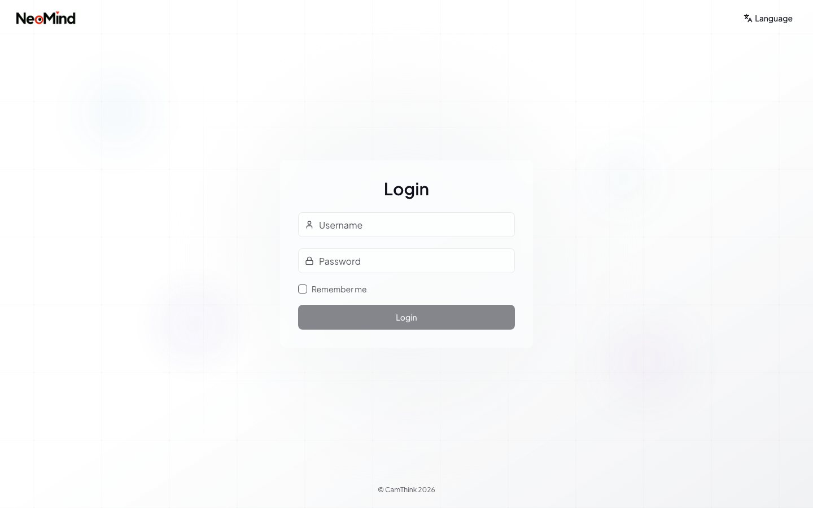</td>
    <td></td>
  </tr>
  <tr>
    <td><b>AI Agent</b></td>
    <td><b>Rule Engine</b></td>
  </tr>
  <tr>
    <td>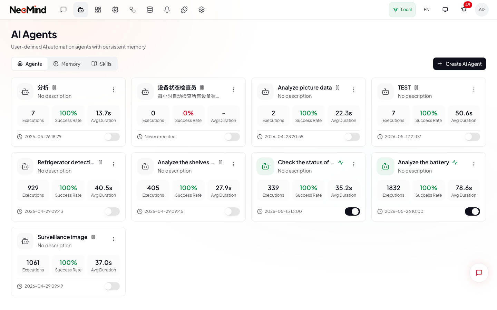</td>
    <td>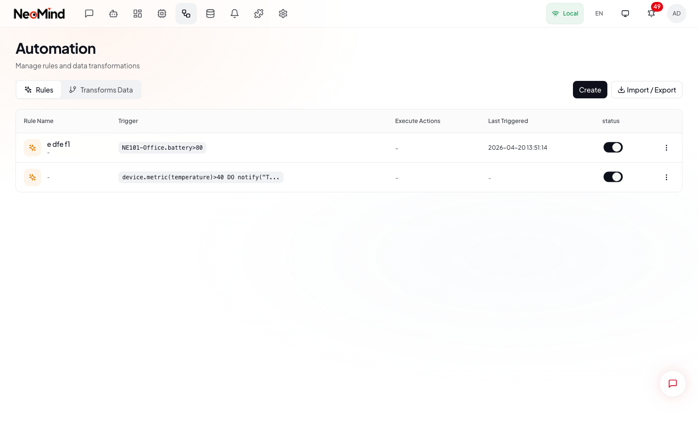</td>
  </tr>
  <tr>
    <td><b>Biến đổi dữ liệu</b></td>
    <td><b>Tin nhắn</b></td>
  </tr>
  <tr>
    <td>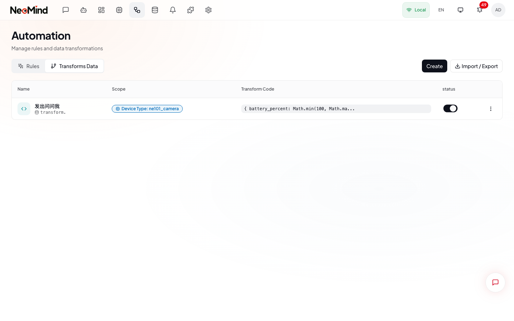</td>
    <td>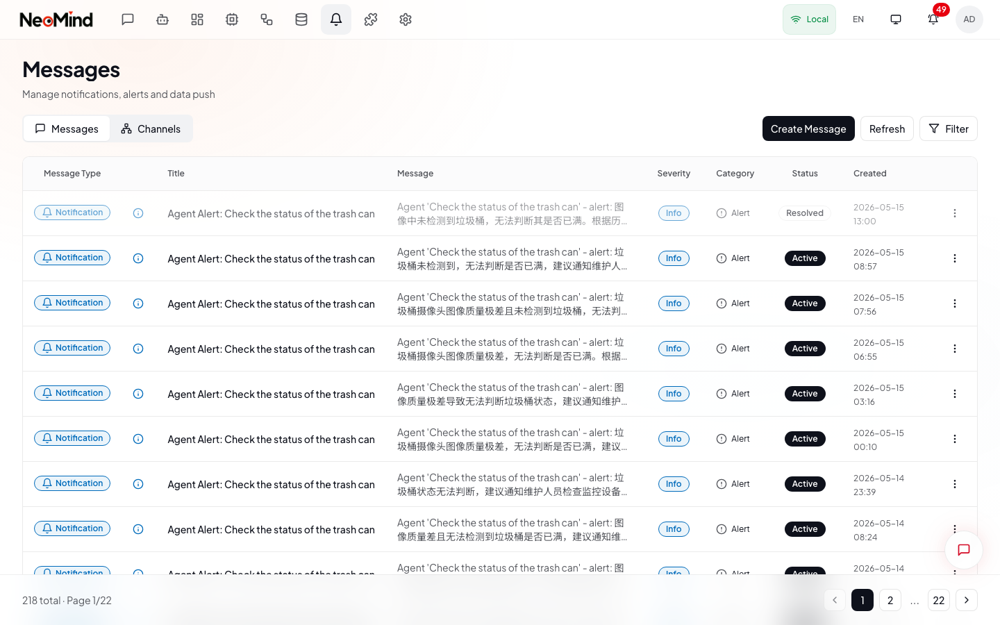</td>
  </tr>
  <tr>
    <td><b>Extension</b></td>
    <td><b>Đẩy dữ liệu</b></td>
  </tr>
  <tr>
    <td>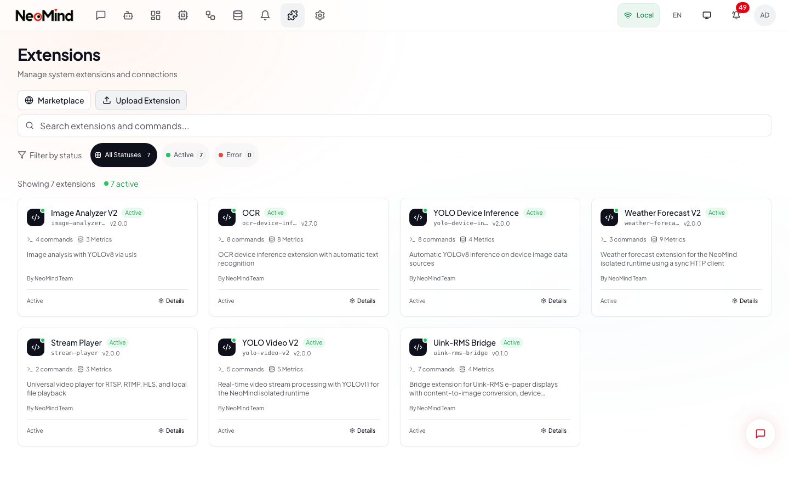</td>
    <td>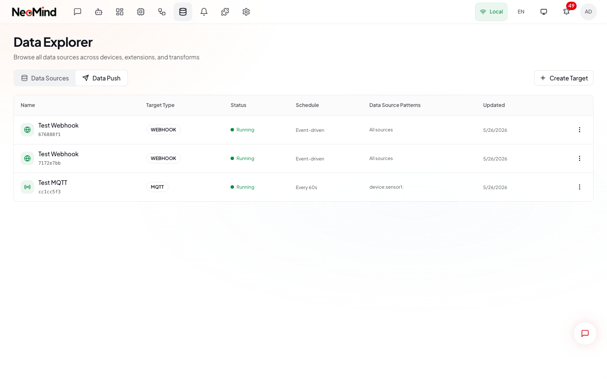</td>
  </tr>
  <tr>
    <td><b>Backend LLM</b></td>
    <td><b>Di động</b></td>
  </tr>
  <tr>
    <td>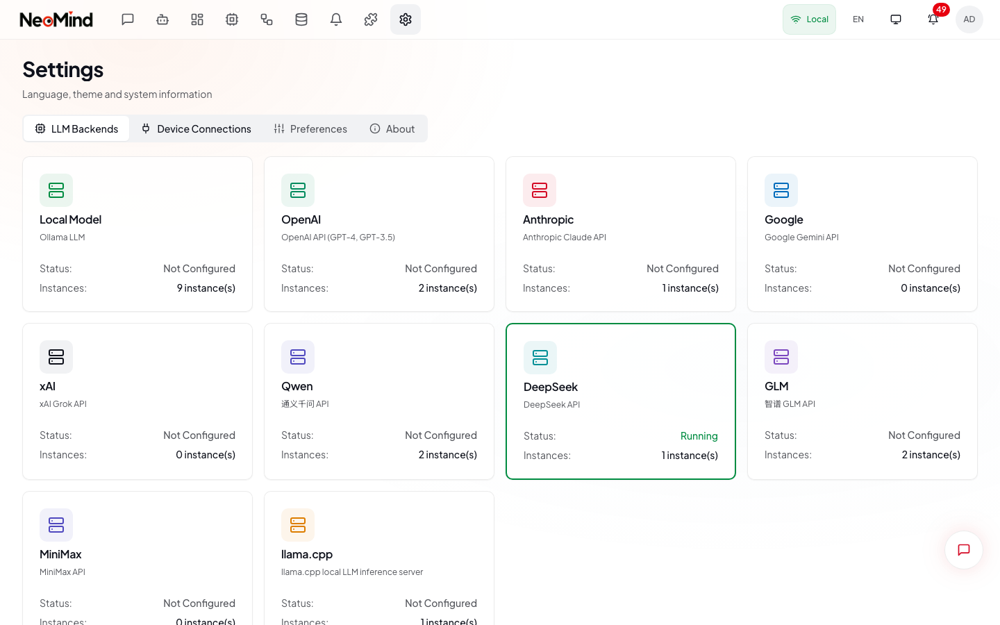</td>
    <td></td>
  </tr>
</table>

</details>

## Cấu hình

### Backend LLM được hỗ trợ

Ollama (cục bộ), OpenAI, Anthropic, Google, xAI, Qwen, DeepSeek, GLM, MiniMax, và mọi endpoint tương thích OpenAI. Cấu hình tại trang **Settings → LLM Backends** trong UI.

<details>
<summary>Biến môi trường</summary>

| Biến | Mặc định | Mô tả |
|------|----------|-------|
| `RUST_LOG` | `info` | Mức log (trace, debug, info, warn, error) |
| `HERAMIND_DATA_DIR` | `/var/lib/heramind` | Thư mục dữ liệu |
| `HERAMIND_BIND_ADDR` | `0.0.0.0:9375` | Địa chỉ bind của server |
| `SERVER_PORT` | `9375` | Cổng API server |

</details>

## Tham khảo CLI

```bash
heramind serve                          # Chạy API server
heramind health                        # Kiểm tra sức khỏe hệ thống
heramind device list                   # Liệt kê thiết bị
heramind device create --name "..."    # Tạo thiết bị
heramind rule list                     # Liệt kê quy tắc tự động hóa
heramind extension list                # Liệt kê extension
heramind extension install file.nep    # Cài đặt extension
heramind agent list                    # Liệt kê AI agent
heramind message list                  # Liệt kê tin nhắn
heramind system info                   # Trạng thái hệ thống & thông tin mạng
heramind api-key create                # Tạo API key
```

## Phát triển extension

Xây dựng extension bằng Rust SDK với cô lập tiến trình. Xem [Hướng dẫn lập trình viên](https://docs.cvedix.com/heramind) và [tài liệu HeraMind](https://docs.cvedix.com/heramind) để có ví dụ đầy đủ.

<details>
<summary>Ví dụ nhanh</summary>

```rust
use heramind_extension_sdk::prelude::*;

pub struct MyExtension;

#[async_trait]
impl Extension for MyExtension {
    fn metadata(&self) -> &ExtensionMetadata {
        static META: OnceLock<ExtensionMetadata> = OnceLock::new();
        META.get_or_init(|| {
            ExtensionMetadata::new("my-extension", "My Extension", "1.0.0")
                .with_description("My custom extension")
                .with_author("Your Name")
        })
    }

    async fn execute_command(&self, cmd: &str, args: &Value) -> Result<Value> {
        match cmd {
            "do_something" => Ok(json!({ "result": "done" })),
            _ => Err(ExtensionError::CommandNotFound(cmd.to_string())),
        }
    }

    fn produce_metrics(&self) -> Result<Vec<ExtensionMetricValue>> {
        Ok(vec![])
    }
}

heramind_export!(MyExtension);
```

</details>

## Tài liệu

Toàn bộ tài liệu người dùng, cài đặt, và lập trình viên nằm trên **[tài liệu HeraMind](https://docs.cvedix.com/heramind)**:

| Mục tài liệu | Nội dung |
|----------|----------|
| [Tổng quan sản phẩm](https://docs.cvedix.com/heramind) | HeraMind là gì, khái niệm lõi, kiến trúc |
| [Khởi động nhanh](https://docs.cvedix.com/heramind) | Hướng dẫn năm phút để chạy instance đầu tiên |
| [Cài đặt & thiết lập](https://docs.cvedix.com/heramind) | Ứng dụng desktop, server, Docker, cấu hình |
| [Hướng dẫn lập trình viên](https://docs.cvedix.com/heramind) | REST/WebSocket API, extension, tích hợp |

Tài liệu tham khảo cục bộ trong repo (dành cho người đóng góp):

| Tài nguyên | Mô tả |
|------------|-------|
| [CLAUDE.md](CLAUDE.md) | Hướng dẫn phát triển và quy ước code |
| [CHANGELOG.md](CHANGELOG.md) | Lịch sử phiên bản và ghi chú phát hành |
| [Frontend Spec](web/DESIGN_SPEC.md) | Design system UI và tiêu chuẩn component |

## Tech stack

| Tầng | Công nghệ |
|------|-----------|
| **Backend** | Rust, Axum, Tokio, redb |
| **Frontend** | React 18, TypeScript, Tailwind CSS, Zustand, Radix UI |
| **Desktop** | Tauri 2.x |
| **AI/LLM** | Ollama, OpenAI, Anthropic, và hơn 6 backend khác |
| **IoT** | MQTT (broker nhúng), BLE, HTTP/Webhook |
| **Extension** | Native (.so/.dylib/.dll), WASM, cô lập tiến trình |

## Cộng đồng

Tham gia cộng đồng để được hỗ trợ, chia sẻ ý tưởng, và cập nhật tin mới:

- **[Discord](https://discord.gg/cvedixai)** — Chat thời gian thực, hỗ trợ, và thông báo (khuyến nghị)
- **[GitHub Issues](https://github.com/CVEDIX/HeraMind/issues)** — Báo lỗi và yêu cầu tính năng
- **[GitHub Discussions](https://github.com/CVEDIX/HeraMind/discussions)** — Hỏi đáp dài hơn và thảo luận thiết kế
- **[Tài liệu HeraMind](https://docs.cvedix.com/heramind)** — Tài liệu đầy đủ

Thông báo phát hành được đăng trong kênh Discord `#announcements` và trên [GitHub Releases](https://github.com/CVEDIX/HeraMind/releases).

## Đóng góp

Mọi đóng góp đều được chào đón! Bạn có thể gửi Pull Request bất cứ lúc nào.

## Giấy phép

[Apache-2.0](LICENSE)
